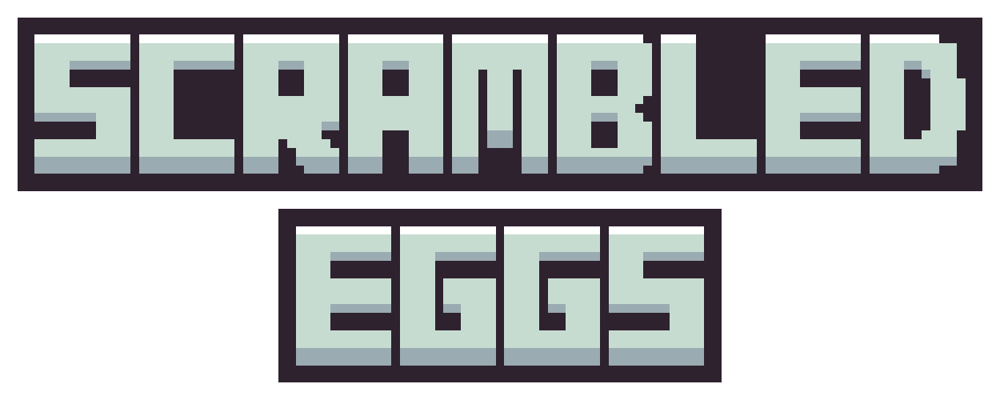
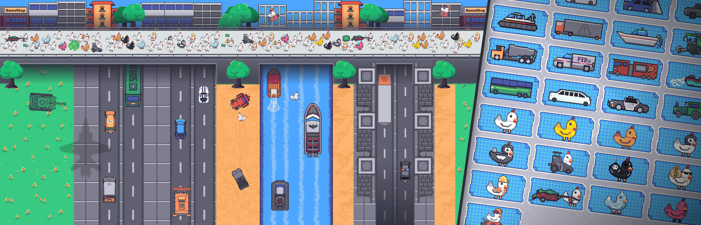

    

    
    
    
    
    
         

# About the Game

Scrambled Eggs is an action-packed chicken tower defense game, where we answer the age-old question **"Why did the chicken cross the road"**. Take on the chicken hordes by sending wacky vehicles with interesting powers, to stop the clucking menace from attacking your corn crops.

Some chickens you may encounter have been gifted **strange abilities**, that might throw a wrench in your mechanical mayhem. Collect the energy tokens that fuel your gasoline-guzzling Chariots.

Place down **heavy machinery** to deal with the bird brains, with recharging _ultimates_. Fight through waves of chickens collecting cash to upgrade your capability to unleash more chicken carnage, with different vehicles, ultimate, and player upgrades to suit the best situations.

Compete against your friends in our **leaderboards** to see who is the best at destroying these mother-cluckers.

 

## Game Jam

This game was originally a submission to the 2023 GMTK Game Jam.

Now, the game-jam classic has been expanded to a **full release free-to-play game** with overwhelmingly positive reviews and accessible gameplay for everyone to enjoy, with **thousands of players** and reviews from several popular YouTubers! View the steam page for more details, information, trailers, and to play the game!

The GMTK Game Jam is an annual game making marathon, where individuals and teams try to make a game that fits a theme, in just **48 hours**. Thousands of games are submitted as designers improve their skills, flex their creative muscles, and try to get their game featured on Game Maker’s Toolkit.

The theme for this game was **Roles Reversed**.

_This game was a role reversal of Crossy Roads, where instead of making a chicken cross the road, the player must use their arsenal of vehicles to stop the chicken from crossing the roadways and stealing the crops._

## Credits

The game is developed by Anahat Mudgal, TheJackXBL, and Jake Horner.

_This reposity was forked from the original to archive the state of the game after its release on Steam with its final patches and before licensing changes._

 

